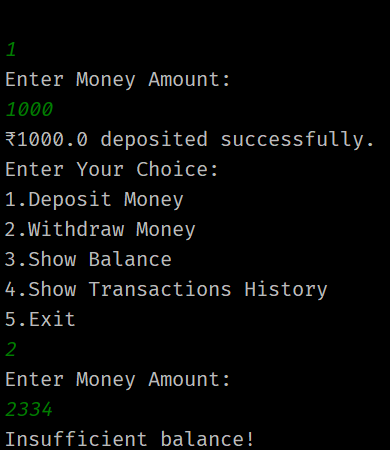

# 💰 Bank Account Simulation

This Java project simulates basic bank operations using **Object-Oriented Programming (OOP)** principles. It allows users to perform actions like depositing money, withdrawing funds, checking account balance, and viewing transaction history — all via a simple terminal menu.

---

## 📌 Features Implemented

- ✅ Deposit Money into Account
- ✅ Withdraw Money from Account (with validation)
- ✅ Show Current Balance
- ✅ View Full Transaction History (with timestamp)
- ✅ Command-line Interface for interaction

---

## 🛠 Technologies Used

- **Java**
- **VS Code / IntelliJ IDEA**
- **Java Collections** (`ArrayList`)
- **OOP Concepts** (Classes, Objects, Inheritance, Method Overriding)
- **Scanner** for user input
- **DateTime API** for timestamping transactions

---

## 📂 Project Structure

```bash
BankAccountSimulation/
├── Main.java               # Entry point with menu-driven interface
├── Account.java            # Core class containing balance and methods
├── Transaction.java        # Helper class for storing transaction details
```
## 😁 Output
