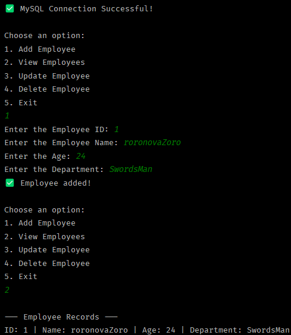

# 🧑‍💼 Employee Management System (Java + MySQL CLI)

This is a simple console-based Employee Management System built using **Java** and **MySQL** with **JDBC**. It allows you to:

- ➕ Add Employee
- 📋 View All Employees
- ✏️ Update Employee
- ❌ Delete Employee

---

## 💻 Technologies Used

- Java (JDK 17)
- MySQL (8+)
- JDBC
- IntelliJ IDEA 

---

## 🛠️ Setup Instructions

1. Make sure MySQL Server is running on `localhost:3306`.
2. Create a database:

   ```sql
   CREATE DATABASE employee_db;
   
## Preview


