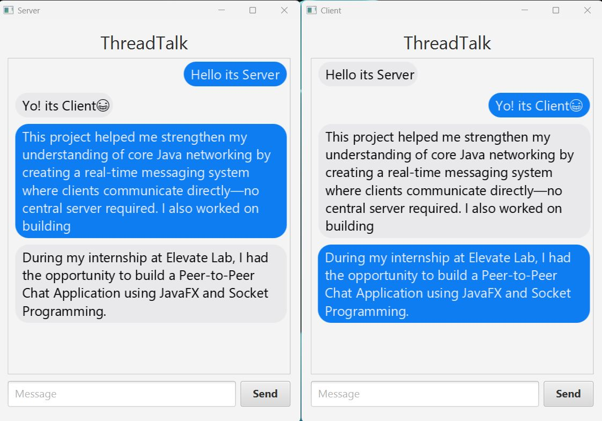

# 🧑‍💻 Java Peer-to-Peer Chat App

A simple real-time chat system built in Java using **Socket Programming** and **JavaFX**. Supports group and private messaging, nicknames, and basic encryption.

---

## 🚀 Features

- Group & private messaging
- JavaFX-based GUI
- Nickname support
- Basic message encryption
- Multi-client support via threads

---

## 🛠️ Tech Stack

- Java (JDK 21+)
- JavaFX
- Socket Programming
- Multithreading

---

## ▶️ How to Run

### 1️⃣ Start the Server

```bash
javac ChatApplication.java
java ChatApplication
```

### 2️⃣ Start the Client(s)

```bash
javac ChatApplicationClient.java
java ChatApplicationClient
```


---

## 📸 Screenshots



---

## 👨‍💻 Author

**Vivek Ramesh Sonawale**  
[GitHub](https://github.com/viveksonawale) | [LinkedIn](https://www.linkedin.com/in/vivek-sonawale)
