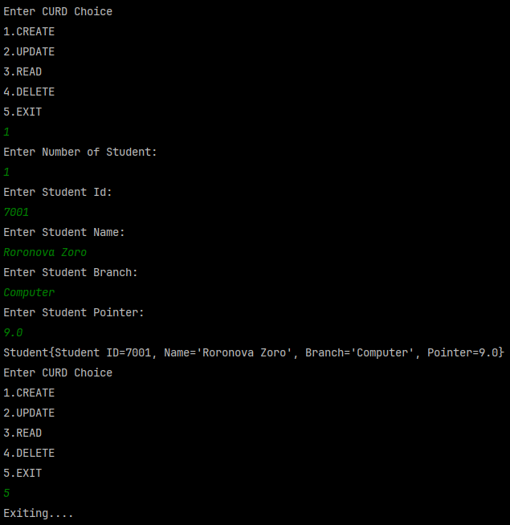

# Student Management System (Java, ArrayList)

## 📌 Overview

This is a **console-based CRUD (Create, Read, Update, Delete)** system written in **Java**.  
It allows you to:
- Create student records
- Update student details
- Read/display student records
- Delete student records
- Exit the program

## ⚙️ Tools & Technologies Used

| Tool / Concept | Purpose |
|---------------|---------|
| Java | Programming language used |
| ArrayList (`java.util.ArrayList`) | To store student objects dynamically |
| List Interface | Allows flexibility by coding to interface |
| Scanner (`java.util.Scanner`) | To take input from the user |
| switch-case | To handle different user choices |

## 💡 Concepts Applied

- **Object-Oriented Programming (OOP)**: The `Student` class represents a student entity with properties and methods.
- **Encapsulation**: Student data is bundled inside the `Student` class.
- **Dynamic Data Structures**: Used `ArrayList<Student>` for managing student data without a fixed size.
- **CRUD Operations**: The application lets you create, read, update, or delete student records.
- **Control Flow**: switch-case, loops, and if-else statements for managing logic flow.

## 📝 Features

✅ **Create**: Add new students by entering ID, name, branch, and pointer.  
✅ **Update**: Update name, branch, or pointer of a student using student ID.  
✅ **Read**: Display all students' details.  
✅ **Delete**: Delete a student record using student ID.  
✅ **Exit**: Exit the application safely.

## 📌 Example

