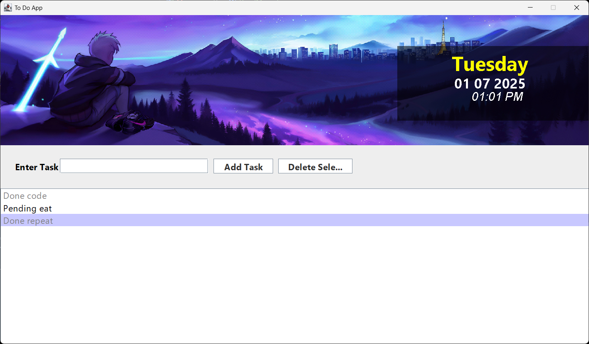

# Task 6 : Java GUI – ToDo App.📝

This is a simple **To-Do List desktop application** built using **Java Swing**. It allows users to:
- Add new tasks
- Delete selected tasks
- Mark tasks as **Done** or **Pending** with one click
- View tasks in a scrollable list
- Enjoy a visually styled UI with background image and live date & time

---

## 🚀 Features

- ✅ Add task with text input
- ✅ Delete selected task
- ✅ Toggle task status (Pending ↔ Done) by clicking on the task
- ✅ Real-time Date, Time, and Day displayed
- ✅ Custom UI with background image using `ImagePanel`
- ✅ Clean and modern layout with absolute positioning

---

## 🖥️ UI Preview

